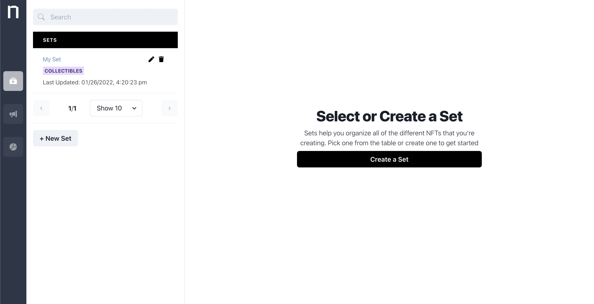

# Sets

**Sets** are primarily a way to organize your NFT Collection. Under **Sets**, you'll see your **Collectibles,** which are essentially templates for all of the NFTs that are being made. These **Sets** are created and minted directly on the blockchain.&#x20;

To create a **Set**, simply add in a name and any other metadata that you'd like the set to have.&#x20;

**Field Reference:**&#x20;

* Title (Required): A unique name for this set.
* Set Type (Required): This is currently limited to Collectibles, with other types of Sets coming soon (i.e. Generative NFTs)
* Blockchain Metadata (Optional): Any additional metadata (key, value pairs) that you'd like to be added to the blockchain for this set.&#x20;
